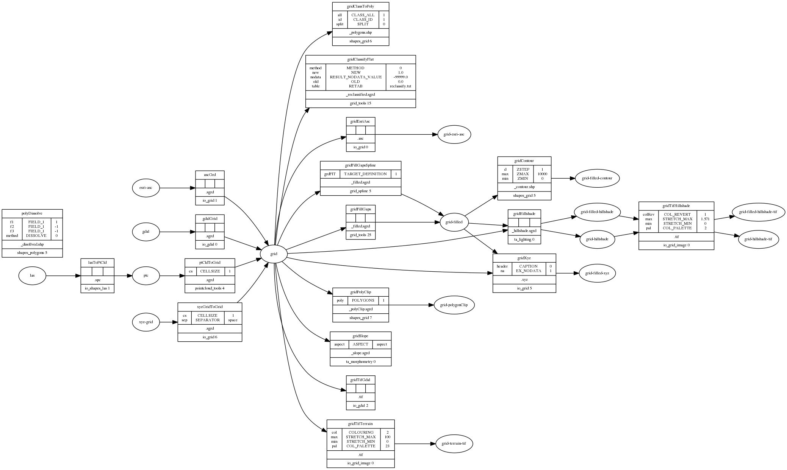

# Description

Haskell Library to wrap `saga_cmd`. 

Two exectuables are currently shipped

-   **sagaChain:** A program to chain different saga-calls, where the output of
    one command gets the input of the next.

-   **sagaTopo:** Wrapper to create topographic-maps out of `sgrid`-files

This is *Work In Progress*

# Installation

## Saga And haskell-platform

### Linux

    sudo aptitude install haskell-platform
    sudo aptitude install saga

### Windows with Cygwin

-   Get the [haskell-platform](http://www.haskell.org/platform/)

-   Install Saga with [OSGeo4W](http://trac.osgeo.org/osgeo4w/)

-   Put `saga_cmd` in the search path; add the line following (the actual
    filepath could differ) line to your `$HOME/.bashrc`
    
        export PATH="$PATH:/cygdrive/c/Program Files (x86)/SAGA-GIS

## saga-cmd-wrapper library

    git clone https://www.github.com/michelk/saga-cmd-wrapper.hs.git
    cd saga-cmd-wrapper.hs
    cabal update && cabal install

The exectuables are usually installed into `$HOME/.cabal/bin`; to
use them you have to put them into your search path. Put this into
your `$HOME/.bashrc`:

    export PATH="$PATH:$HOME/.cabal/bin"

# Usage

## `sagaChain`

`sagaChain` lets you chain `saga_cmd` commands. The program needs the
follwing specification:

-   source-format

-   destination-format

-   parameters to use for conversion

-   input-file
    
    These combinations are currently supported, where columns are
    sources and rows destinations:
    
    <table border="2" cellspacing="0" cellpadding="6" rules="groups" frame="hsides">
    
    
    <colgroup>
    <col  class="left" />
    
    <col  class="left" />
    
    <col  class="left" />
    
    <col  class="left" />
    
    <col  class="left" />
    </colgroup>
    <thead>
    <tr>
    <th scope="col" class="left">to\form</th>
    <th scope="col" class="left">las</th>
    <th scope="col" class="left">xyz-grid</th>
    <th scope="col" class="left">grid</th>
    <th scope="col" class="left">grid-filled</th>
    </tr>
    </thead>
    
    <tbody>
    <tr>
    <td class="left">grid</td>
    <td class="left">X</td>
    <td class="left">X</td>
    <td class="left">&#xa0;</td>
    <td class="left">&#xa0;</td>
    </tr>
    
    
    <tr>
    <td class="left">grid-filled</td>
    <td class="left">X</td>
    <td class="left">X</td>
    <td class="left">X</td>
    <td class="left">&#xa0;</td>
    </tr>
    
    
    <tr>
    <td class="left">hillshade</td>
    <td class="left">X</td>
    <td class="left">X</td>
    <td class="left">x</td>
    <td class="left">X</td>
    </tr>
    
    
    <tr>
    <td class="left">contour</td>
    <td class="left">X</td>
    <td class="left">X</td>
    <td class="left">X</td>
    <td class="left">X</td>
    </tr>
    </tbody>
    </table>
    
    where

-   **grid       :** A Grid which could contain gaps

-   **grid-filled:** A Grid with interpolated values

-   **hillshade  :** Analytical hillshade

-   **contour    :** Iso-value-lines
    
    
    
    For example
    
        sagaChain --from xyz-grid --to hillshade --parameters xyzSep=tabulator:xyzCellSize=0.5

## `sagaTopo`

Wrapper-program to create topographic maps from `sgrd`-files

For example

    sagaTopo --min 280 --max 360  -o dem.tif dem.sgrd

# Development

In order to extend functionality

-   find the wanted library and module

-   create wrapper function

-   define output extension

-   add chains

## Find the module

    cd saga-cmd-wrapper/do
    ./search <keyword> 

## Wrapper function and chain definition

-   edit `src/Math/Geometry/Saga/Data.hs`

-   add chain

-   add wrapper function

# ToDo

-   extend library-commands

-   merge `sagaTopo` into `sagaChain`

-   give the opportunity to clean intermediate files (sagaChain,sagaTopo)
